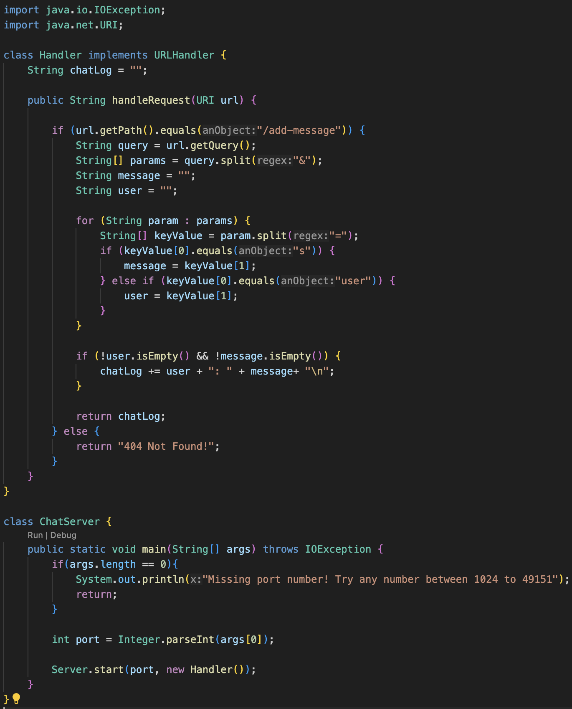
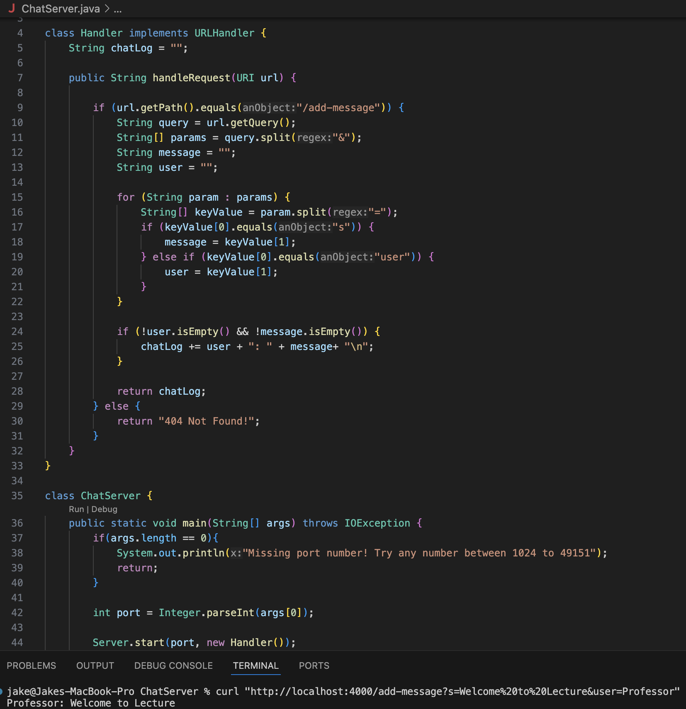
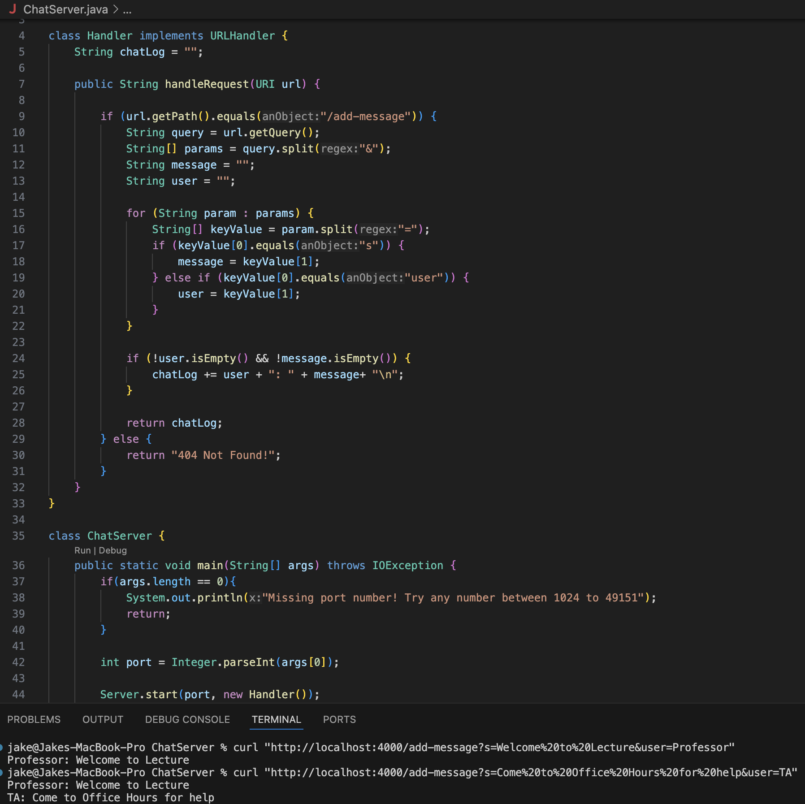
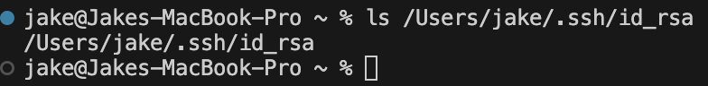
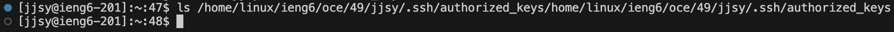
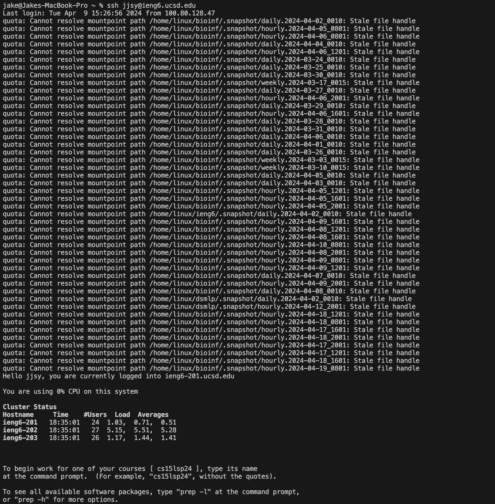

UCSD CSE15L Spring 2024 - Week 4
# Lab Report 2 
---
## Part 1: `ChatServer`

The screenshot below shows the code for my `ChatServer`.

Running the first `/add-message` command:

After running `curl "http://localhost:4000/add-message?s=Welcome%20to%20Lecture&user=Professor"`:
* The method `handleRequest(URI url)` from the `Handler` class is called after making the first `curl` request.
* Argument is a `URI` passed by the `curl` command: `/add-message?s=Welcome%20to%20Lecture&user=Professor`
* Relevant field of the `Handler` class is the string `chatLog`, which is an empty string before the request
* This specific request changes the value of `chatLog` from `“”` to `“Professor: Welcome to Lecture \n;”`

Running the second `/add-message` command:

After running `curl "http://localhost:4000/add-message?s=Come%20to%20Office%20Hours%20for%20help&user=TA"`:
* The method `handleRequest(URI url)` from the `Handler` class is called again after making the second `curl` request.
* Argument is a `URI` passed by the `curl` command: `/add-message?s=Come%20to%20Office%20Hours%20for%20help&user=TA`
* Relevant field of the `Handler` class is the string `chatLog`, which is `“Professor: Welcome to Lecture \n;”` before the request.
* This specific request changes the value of `chatLog` from `“Professor: Welcome to Lecture \n;”` to `"Professor: Welcome to Lecture\nTA: Come to Office Hours for help\n"` 

---
## Part 2: `SSH`

This screenshot shows me running `ls` locally on the command line of my computer with the **absolute path** to the *private* key for my SSH key for logging into `ieng6`.

This screenshot shows me running `ls` remotely on the command line of the `ieng6` machine with the **absolute path** to the *public* key for my SSH key for loging into `ieng6`.

This screenshot shows a terminal interaction where I logged into my `ieng6` account without being prompted for a password.

---
## Part 3: What I Learned

The two most significant things I have learned from lab in week 2 and 3 that I didn't know prior are how to use the `curl` command and how to `SSH` remotely to `ieng6`. Knowing the `curl` command allows me to interact with web servers directly through the command line without having to use the browser (as demonstrated in Skill Demo 1). Learning to use SSH for remote access allows me to access my `ieng6` machine and related files from a separate location, which lets me access the processing power of my `ieng6` machine even if the laptop I am using remotely is underpowered.

---
