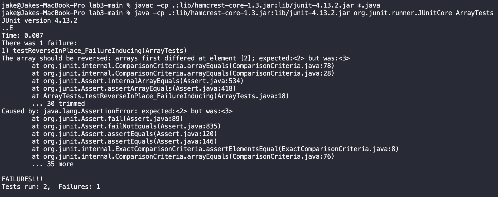

UCSD CSE15L Spring 2024 - Week 6
# Lab Report 3
---
## Part 1: Bugs

For this portion of the lab report, I chose to focus on the bug present in the `reverseInPlace` method in the `ArrayExamples` class.

1. A failure-inducing input for the buggy program (as a JUnit test) is shown in the code block below:
```
@Test
  public void testReverseInPlace_FailureInducing() {
    int[] original = {1, 2, 3, 4};
    ArrayExamples.reverseInPlace(original);
    int[] expected = {4, 3, 2, 1};
    assertArrayEquals("The array should be reversed", expected, original);
  }
```

2. An input that doesn't induce a failure (as a JUnit test) is shown in the code block below:
```
@Test 
  public void testReverseInPlace() {
    int[] input1 = { 3 };
    ArrayExamples.reverseInPlace(input1);
    assertArrayEquals(new int[]{ 3 }, input1);
  }
```

3. The symptom, as the output of running the two tests above, is shown in the screenshot below. Note that one test passes and one test fails:


4. The original unmodified buggy `reverseInPlace` method:
```
// Changes the input array to be in reversed order
  static void reverseInPlace(int[] arr) {
    for(int i = 0; i < arr.length; i += 1) {
      arr[i] = arr[arr.length - i - 1];
    }
  }
```
The fixed `reverseInPlace` method after changing the code:
```
static void reverseInPlace(int[] arr) {
    for(int i = 0; i < arr.length / 2; i++) {
        int temp = arr[i];
        arr[i] = arr[arr.length - i - 1];
        arr[arr.length - i - 1] = temp;
    }
}
```
5. Description of why the fix addresses the issue:
The fix resolves the issue in the original `reverseInPlace` method by guaranteeing that the loop only iterates through half of the array; this addresses the issue where elements are overwritten before they can be swapped to the correct position. The temporary variable `temp` allows the method to store the value of `arr[i]` before it is overwritten. These changes will address the failure-inducing input such that the test passes and the input no longer returns the incorrectly reversed array `{4, 3, 3, 4}`.

---
## Part 2: Researching Commands

For this portion of the lab report, I chose the command `grep`. I learned about the four interesting command-line options for `grep` I demonstrate below thanks to this GeeksForGeeks page: [grep command](https://www.geeksforgeeks.org/grep-command-in-unixlinux/#options-available-in-grep-command)

Option 1: `grep -r` to search recursively for a pattern in the directory

* Example 1: In this example, we use `grep -r` to search all text files within `./technical` (including text files contained within subdirectories) for the string `"middle-class"`.
```
jake@Jakes-MacBook-Pro technical % grep -r middle-class
./government/Media/Raising_the_Bar.txt:His middle-class upbringing in the '50s and '60s produced a
./government/Media/Working_for_Free.txt:button-down shirts, Zucker grew up in an upper-middle-class enclave
./government/Media/A_helping_hand.txt:the need despite having a middle-class upbringing. But a
./911report/chapter-5.txt:                middle-class family headed by his father, an attorney. After graduating from Cairo
jake@Jakes-MacBook-Pro technical %
```

* Example 2: In this example, we use `grep -r` to search all files within the `./technical` for email addresses by matching the pattern `"@."`.

```
jake@Jakes-MacBook-Pro technical % grep -r "@.*\." .
./government/Gen_Account_Office/d0269g.txt:calboml@gao.gov,or Tom Broderick, Assistant Director,
./government/Gen_Account_Office/d0269g.txt:broderickt@gao.gov
./government/Gen_Account_Office/d0269g.txt:fraudnet@gao.gov,or
./government/Gen_Account_Office/Testimony_cg00010t.txt:"info" in the body to: Info@www.gao.gov or visit GAO's World Wide
./government/Gen_Account_Office/Testimony_cg00010t.txt:Email: fraudnet@gao.gov 18004245454 (automated answering
./government/Gen_Account_Office/GovernmentAuditingStandards_yb2002ed.txt:yellowbook@gao.gov.To ensure that your comments are
./government/Gen_Account_Office/Sept27-2002_d02966.txt:HighlightsTest@gao.gov.
./government/Gen_Account_Office/Sept27-2002_d02966.txt:mihmj@gao.gov. Janice Lichty and BryanRasmussen were
./government/Gen_Account_Office/Sept27-2002_d02966.txt:fraudnet@gao.gov
./government/Gen_Account_Office/Sept27-2002_d02966.txt:NelliganJ@gao.gov(202) 512-4800
./government/Gen_Account_Office/d01376g.txt:can be reached at (202) 512-7957 or DiamondL@GAO.GOV. Key
./government/Gen_Account_Office/d01376g.txt:info@www.gao.gov
./government/Gen_Account_Office/d01376g.txt:• e-mail: fraudnet@gao.gov •
./government/Gen_Account_Office/pe1019.txt:info@www.gao.gov
./government/Gen_Account_Office/Testimony_Jul15-2002_d02940t.txt:Acknowledgments mihmj@gao.gov. Individuals making key
./government/Gen_Account_Office/gg96118.txt:info@www.gao.gov
./government/Gen_Account_Office/July11-2001_gg00172r.txt:send email message with "info" in the body to: info@www.gao.gov or
./government/Gen_Account_Office/July11-2001_gg00172r.txt:EMail: fraudnet@gao.gov Telephone: 18004245454 (automated
./government/Gen_Account_Office/d01121g.txt:digitalguide@gao.gov. We will assess your request and inform you of
./government/Gen_Account_Office/d01121g.txt:preceding letter, send your e-mail request to digitalguide@gao.gov.
./government/Gen_Account_Office/d03419sp.txt:SteinhoffJ@gao.gov.
./government/Gen_Account_Office/d03419sp.txt:fraudnet@gao.gov
./government/Gen_Account_Office/d03419sp.txt:NelliganJ@gao.gov(202) 512-4800
./government/Gen_Account_Office/Testimony_d01609t.txt:info@www.gao.gov
./government/Gen_Account_Office/Testimony_d01609t.txt:fraudnet@gao.gov Automated answering system: 18004245454
./government/Gen_Account_Office/d03273g.txt:E-mail: fraudnet@gao.gov
./government/Gen_Account_Office/d03273g.txt:Jeff Nelligan, managing director, NelliganJ@gao.gov (202)
./government/Gen_Account_Office/Oct15-1999_gg00026t.txt:info@www.gao.gov
./government/Gen_Account_Office/d03232sp.txt:at AgencyProtocols@gao.gov.
./government/Gen_Account_Office/d03232sp.txt:e-mail to AgencyProtocols@gao.gov.
./government/Gen_Account_Office/June30-2000_gg00135r.txt:send email message with "info" in the body to: info@www.gao.gov or
./government/Gen_Account_Office/June30-2000_gg00135r.txt:EMail: fraudnet@gao.gov Telephone: 18004245454 (automated
./government/Gen_Account_Office/d01591sp.txt:info@www.gao.gov
./government/Gen_Account_Office/d01591sp.txt:• e-mail: fraudnet@gao.gov •
./government/Gen_Account_Office/Oct15-2001_d0224.txt:mail me at daceyr@gao.gov. Major contributors to this
./government/Gen_Account_Office/Oct15-2001_d0224.txt:fraudnet@gao.gov, or1-800-424-5454 (automated
./government/Gen_Account_Office/Oct15-2001_d0224.txt:Jeff Nelligan, Managing Director, NelliganJ@gao.gov (202)
./government/Gen_Account_Office/d01145g.txt:info@www.gao.gov
./government/Gen_Account_Office/d01145g.txt:e-mail: fraudnet@gao.gov
./government/Gen_Account_Office/InternalControl_ai00021p.txt:info@www.gao.gov
./government/Gen_Account_Office/d01186g.txt:info@www.gao.gov
./government/Gen_Account_Office/d01186g.txt:• e-mail: fraudnet@gao.gov •
./government/Gen_Account_Office/ai00134.txt:to me at (202) 5122600, steinhoffj.aimd@gao.gov, or Linda Garrison,
./government/Gen_Account_Office/ai00134.txt:info@www.gao.gov
./government/Gen_Account_Office/ai00134.txt:• e-mail: fraudnet@gao.gov •
./government/Gen_Account_Office/ai9868.txt:at 202-512-6240 or brockj.aimd@gao.gov.
./government/Gen_Account_Office/May1998_ai98068.txt:at 202-512-6240 or brockj.aimd@gao.gov.
./government/Gen_Account_Office/d02701.txt:fraudnet@gao.gov
./government/Gen_Account_Office/d02701.txt:NelliganJ@gao.gov(202) 512-4800
./government/Gen_Account_Office/ai2132.txt:info@www.gao.gov
./government/Gen_Account_Office/ai2132.txt:• e-mail: fraudnet@gao.gov •
./government/Post_Rate_Comm/Mitchell_RMVancouver.txt:to rmit@iname.com.
./government/Post_Rate_Comm/Mitchell_6-17-Mit.txt:robert.w.mitchell@prc.gov or 1333 H ST NW Suite 300, Washington DC
./government/Media/highlight_Senior_Day.txt:at 522-3069 or mailto:richard.ingham@okdhs.org
./government/Media/Wingates_winds.txt:bbennett@herald.com
./government/Media/Avoids_Budget_Cut.txt:Reach Stephanie Hoops at stephanie.hoops@tuscaloosanews.com or
./government/Media/Marylands_Legal_Aid.txt:Services Corp. He can be reached at rhudy@mlsc.org. Joe Surkiewicz
./government/Media/Marylands_Legal_Aid.txt:email is jsurkiewicz@mdlab.org.
./government/Media/A_helping_hand.txt:By Joanna Corman / joanna.corman@latimes.com
./government/Media/Retirement_Has_Its_Appeal.txt:617-523-5600 or e-mail Senior Lawyers @aol.com.
./plos/pmed.0010060.txt:        Unfortunately, the availability of review documents on Drugs@FDA is sporadic. To take
./biomed/gb-2002-3-9-research0046.txt:          mged-mage@lists.sourceforge.net, which is available as a
./biomed/1471-2105-3-2.txt:        , "A Story" [ 63 ] , and "AA.AG@helix.ends" [ 64 ] ) and
./biomed/1471-2148-1-4.txt:          should be addressed to S.B.H. (e-mail: sbh1@psu.edu) or
jake@Jakes-MacBook-Pro technical %
```

Option 2: `grep -i` for case insensitive search

* Example 1: In this example, we use `grep -i` to search the text file `rr37.txt` located in the `biomed` subdirectory for all lines that contain the string `"ambulatory"`.
```
jake@Jakes-MacBook-Pro biomed % grep -i "ambulatory" rr37.txt

        practice, accounting for about 1% of all ambulatory visits
        ambulatory care for asthma, making this an unlikely
jake@Jakes-MacBook-Pro biomed %
```

* Example 2: In this example, we use `grep -i` to search the text file `preface.txt` located in the `911report` subdirectory for all lines that contain the string `"lethal"`.
```
jake@Jakes-MacBook-Pro 911report % grep -i "lethal" preface.txt

            We learned about an enemy who is sophisticated, patient, disciplined, and lethal. The
jake@Jakes-MacBook-Pro 911report %
```

Option 3: `grep -c` for displaying the count of number of matches

* Example 1: In this example, we use `grep -c` to find the number of lines within the text file `bcr571.txt` (located in the `biomed` subdirectory) that contain the string `"genes"`. The output tells us there are 10 lines within the text file containing the word genes.
```
jake@Jakes-MacBook-Pro biomed % grep -c "genes" bcr571.txt
10
jake@Jakes-MacBook-Pro biomed %
```

* Example 2: In this example, we use `grep -c` to find the number of lines within the text file `chapter-5.txt` (located in the `911report` subdirectory) that contain the string `"planes"`. The output tells us there are 30 lines within this text file containing the word planes.
```
jake@Jakes-MacBook-Pro 911report % grep -c "planes" chapter-5.txt
30
jake@Jakes-MacBook-Pro 911report %
```

Option 4: `grep -v` to invert the pattern match

* Example 1: In this example, we use `grep -v` to search the text file `pmed.0020191.txt` (located in the `plos` subdirectory) for all lines that do not contain the string `"institutions"`.
```
jake@Jakes-MacBook-Pro plos % grep -v "institutions" pmed.0020191.txt 
        The excellent article by Jordan Paradise, Lori B. Andrews, and colleagues, “Ethics.
        Constructing Ethical Guidelines for Biohistory” [1], neither advocates nor argues against
        biohistorical research; instead, it points out that such investigations are currently
        taking place without guidelines—ethical, scientific, moral, or religious. The question
        governments, medical examiners, family members, or intrepid biographers are to be given
        permission? Who is to decide what is “historically significant”? Not to mention the
        meta-question: who is to decide who is to decide? I apologize to the authors if my brief
        comments [2] implied that they took a position on this issue.
jake@Jakes-MacBook-Pro plos % 
```

* Example 2: In this example, we use `grep -v` to search the text file `water_fees.txt` (located in the `media` subdirectory in the `government` subdirectory) for all lines that do not contain the string `"water"`.


```
jake@Jakes-MacBook-Pro media % grep -v "water" water_fees.txt
It's either a big increase or a loss of service for the Tulare
County town.
By Joan Obra
losing service at the end of the month.
The debate will unfold tonight at a Tulare County Water Works
homes in Alpaugh, faces an unpalatable choice: raise its monthly
$20 household fee or go without the arsenic-tainted and undrinkable
Tulare County Water Works' contract with its only supplier,
recordkeeping and maintenance services to Tulare County Water
as of July 1, at a monthly price of $43.50 for a household.
"We can no longer do it for $20," said Alpaugh Irrigation board
president Steve Martin. The district, which didn't increase prices
estimated $330,000 power bill during the state energy crisis. Last
month, Alpaugh Irrigation customers approved a monthly fee increase
from $20 to $68.
If Tulare County Water Works wants to keep its 170 hookups
flowing, Martin said, it must also raise rates.
Tulare County Water Works can't raise prices until a July 17
election. The propertyrelated fee increase requires voter approval
under Proposition 218, a process Tulare County Water Works
officials started after they learned the outcome of Alpaugh
Irrigation's vote.
At tonight's Tulare County Water Works' informational meeting,
leaders will explain the rules. To block the possible fee increase,
51% of property owners in the district must submit protest votes in
writing. No protest vote means approval of the price jump.
But misinformation already is rampant. Sandra Meraz, Tulare
County Water Works board president, interrupted an interview
Tuesday when a screaming and crying farmworker arrived.
Meraz explained later.
Part of the confusion stems from Prop. 218. A section of it
calls eligible voters "owners of record." Another calls them
"tenants ... directly liable to pay the assessment, fee, or charge
in question."
Alpaugh Irrigation's board limited the voter pool to property
owners, sending each English-only notices.
There weren't enough Spanish-speaking voters to warrant
bilingual notices, Martin explained in May.
But that move left Spanish speakers and renters angry. As a
result, Chris Schneider, executive director of Central California
Legal Services, is building a lawsuit against Alpaugh
Irrigation.
The district "should have sent notices to renters in addition to
property owners," he said.
Tulare County Water Works may also come under Schneider's
fire.
The district sent notices only to property owners because "it's
a property-related fee," attorney Patrick Enright said. He's not
yet sure whether Tulare County Water Works will accept renters'
protest votes at the July 17 meeting
jake@Jakes-MacBook-Pro media %
```


