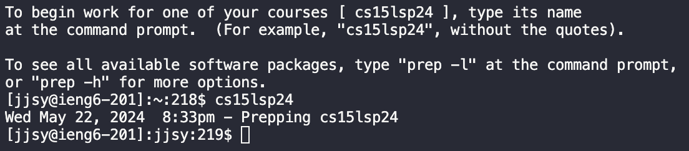

UCSD CSE15L Spring 2024 - Week 8
# Lab Report 4 - Vim
---
## Reproduce Tasks from Steps 4-9 from Week 7's Lab: Doing it All from the Command Line

In this lab report, I will perform the following steps from Week 7's Lab Write-up:

4. Log into ieng6

5. Clone your fork of the repository from your Github account (using the SSH URL)

6. Run the tests, demonstrating that they fail

7. Edit the code file to fix the failing test

8. Run the tests, demonstrating that they now succeed

9. Commit and push the resulting change to your Github account (you can pick any commit message!)

For each step, I will:

A. Take a screenshot

B. Write down exactly which keys you pressed to get to that step, including <enter> and <space>

C. Summarize the commands you ran and what the effect of those keypresses were.

Citation: https://ucsd-cse15l-s24.github.io/week7/index.html
---
## Baseline:

#Step 4: Log into ieng6

A. 

B. For this step, I typed `cs15lsp24` followed by `<enter>` in the command line to navigate to the correct directory for the class.

C. This step ensures that the repository will be cloned to the correct location in the next step.

#Step 5: Clone your fork of the repository from your Github account (using the SSH URL)

A. 

B. For this step, I typed `git clone git@github.com:jjsyucsd/lab7.git` followed by `<enter>` in the command line to clone my fork of the repository from my Github account (using the `SSH` URL).

C. This step clones my fork of the Lab 7 repository to my remote ieng6 machine. 

#Step 6: Run the tests, demonstrating that they fail

A.

B.

C.

