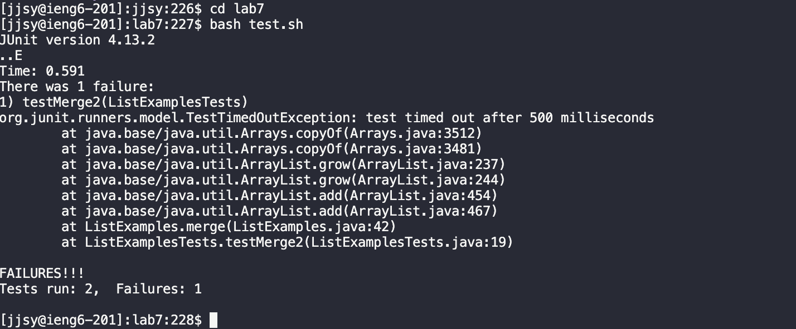

UCSD CSE15L Spring 2024 - Week 8
# Lab Report 4 - Vim
---
## Reproduce Tasks from Steps 4-9 from Week 7's Lab: Doing it All from the Command Line

In this lab report, I will perform the following steps from Week 7's Lab Write-up:

4. Log into ieng6

5. Clone your fork of the repository from your Github account (using the SSH URL)

6. Run the tests, demonstrating that they fail

7. Edit the code file to fix the failing test

8. Run the tests, demonstrating that they now succeed

9. Commit and push the resulting change to your Github account (you can pick any commit message!)

For each step, I will:

A. Take a screenshot

B. Write down exactly which keys you pressed to get to that step including `<enter>` and `<space>`.

C. Summarize the commands you ran and what the effect of those keypresses were.

Citation: https://ucsd-cse15l-s24.github.io/week7/index.html
---
# Baseline:

## Step 4: Log into ieng6

A. 

B. For this step, I typed `cs15lsp24` followed by `<enter>` in the command line to navigate to the correct directory for the class.

C. This step ensures that the repository will be cloned to the correct location in the next step.

## Step 5: Clone your fork of the repository from your Github account (using the SSH URL)

A. 

B. For this step, I typed `git<space>clone<space>git@github.com:jjsyucsd/lab7.git` followed by `<enter>` in the command line to clone my fork of the repository from my Github account (using the `SSH` URL).

C. This step clones my fork of the Lab 7 repository to my remote ieng6 machine. 

## Step 6: Run the tests, demonstrating that they fail

A. 

B. For this step, I typed `cd<space>lab7` followed by `<enter>` then `bash<space>test.sh` followed by `<enter>`.

C. The command `cd lab7` navigates to the correct directory which contains the tests. The command `bash test.sh` runs the `test.sh` script. The script compiles the Java files and runs the tests, providing output in the terminal. From the output, we can determine that one test fails.

## Step 7: Edit the code file to fix the failing test

A. 

B. For this step, these are the exact keys I pressed:
`vim<space>ListExamples.java<enter>` 
`<j><j><j><j><j><j><j><j><j><j><j><j><j><j><j><j><j><j><j><j><j><j><j><j><j><j><j><j><j><j><j><j><j><j><j><j><j><j><j><j><j><j><j>` 
`<l><l><l><l><l><l><l><l><l><l><l>`
`<r><2>`
`:wq<Enter>`

C. The command `vim ListExamples.java` opens the file `ListExamples.java` in Vim for editing. By default the cursor is placed at the start of the file, so we press `<j>` 43 times to get to the beginning of desired line we would like to edit. Then we press `<l>` 11 times to move the cursor down the line until we reach the desired character we want to edit. Now that our cursor is hovering over the `1` in `index1`, we press `<r>` to replace the highlighted character `1`. Since we want to change `index1` to `index2`, we then press `<2>` to replace the highlighted character `1` with the character `2`. Now that the desired change has been successfully made, we press `:wq` followed by `<enter>` to write/save the changes we made to `ListExamples.java` and quit Vim. This returns us to the command line. 

## Step 8: Run the tests, demonstrating that they now succeed

A. 

B. For this step, I typed in the command line `bash<space>test.sh<enter>`.

C. The command `bash test.sh` runs the `test.sh` script, which executes the test cases. The script compiles the Java files and runs the tests, providing output in the terminal. From the output, we can determine that all tests pass.

## Step 9: Commit and push the resulting change to your Github account (you can pick any commit message!)
